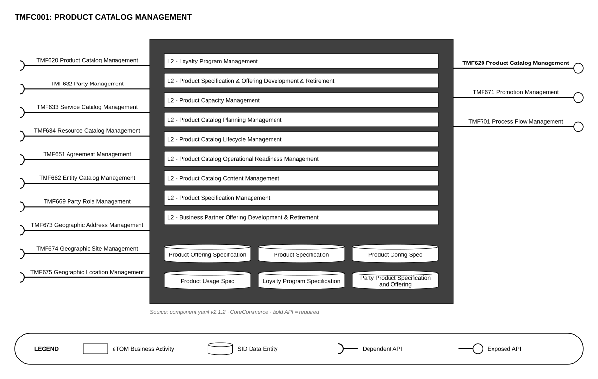

# component-svg-diagram-skill

A Claude skill that renders TM Forum ODA Component architecture diagrams as
standalone SVG, using D3, from each component's `component.yaml` — the
component box with its eTOM business activities and SID data entities,
dependent APIs as sockets on the left and exposed APIs as lollipops on the right.



## Usage

```bash
npm install --prefix skills/svg-diagram/scripts
node skills/svg-diagram/scripts/render.mjs TMFC001   # -> diagrams/TMFC001-architecture.svg
node skills/svg-diagram/scripts/render.mjs all       # every component with a component.yaml
node skills/svg-diagram/scripts/verify.mjs           # check SVGs against the YAML
node skills/svg-diagram/scripts/gallery.mjs          # diagrams/index.html review page
```

Options: `--out`, `--include security,management`, `--etom-levels all`,
`--components-dir`. See [skills/svg-diagram/SKILL.md](skills/svg-diagram/SKILL.md).

## Layout

- `skills/svg-diagram/` — the skill (SKILL.md, scripts, references)
- `spec/` — [spec](spec/spec-svg-diagram.md) and [tasks](spec/tasks-svg-diagram.md)
- `components/` — source component definitions (see [components/README.md](components/README.md))
- `diagrams/` — generated SVGs
